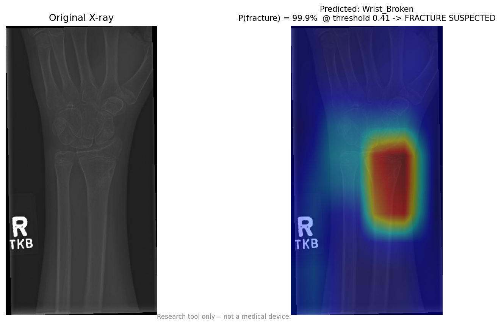
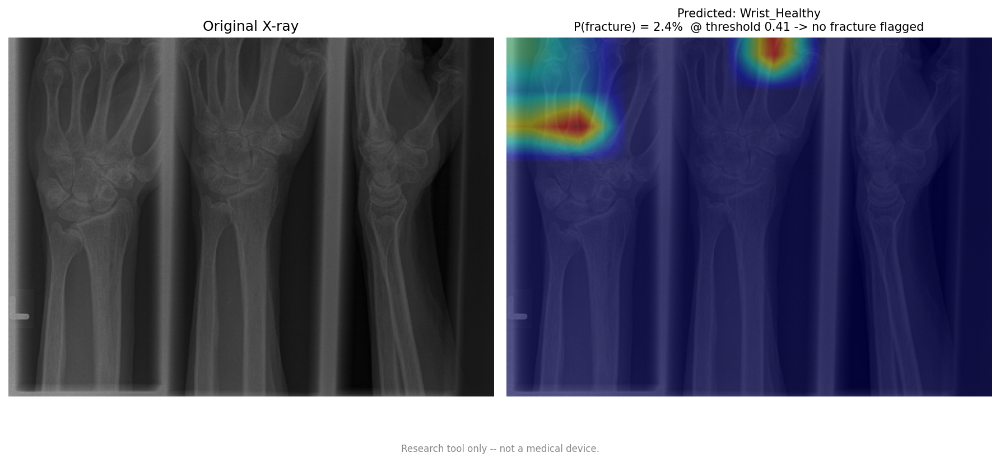
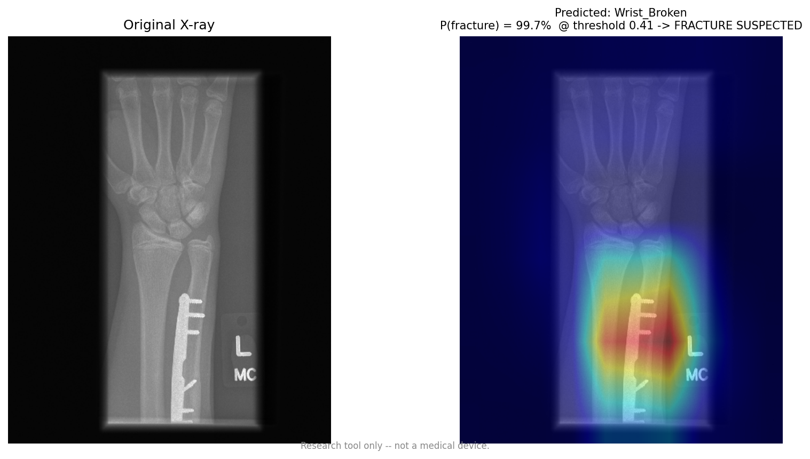

# Musculoskeletal Fracture Detection on MURA

Detects fractures in upper-extremity X-rays — hand, shoulder and wrist — using PyTorch and Stanford's [MURA v1.1](https://stanfordmlgroup.github.io/competitions/mura/) dataset.

**Study-level fracture AUC 0.905, Cohen's kappa 0.684** on the official validation split, with Grad-CAM explanations for every prediction.

> ⚠️ Research and educational project. Not a medical device, not clinically validated, not a substitute for a radiologist.

---

## Results

Evaluated on MURA's official validation split — 1,682 images across 598 studies, patient-disjoint from training.

| Model | Trained by | Res | Study AUC | Study kappa | 6-way acc |
|---|---|---|---|---|---|
| `master_densenet_weights.pth` | `Train_Full_Dataset.py` (v3) | 224 | 0.885 | 0.649 | 81.69% |
| **`v4_densenet.pth`** | **`train_v4.py`** | **320** | **0.9054** | **0.6843** | 81.51% |

Per body part, study level (v4):

| Part | n | AUC | kappa |
|---|---|---|---|
| Wrist | 237 | **0.935** | 0.739 |
| Shoulder | 194 | 0.891 | 0.659 |
| Hand | 167 | 0.886 | 0.628 |

At the recommended operating point (threshold 0.4125, targeting 0.85 sensitivity): **sensitivity 0.861, specificity 0.821** — 36 missed fractures instead of 53 at the default 0.5.

**Reference:** the MURA paper's 169-layer DenseNet reached AUROC 0.929 and kappa 0.705 against a radiologist-adjudicated test set (best individual radiologist: 0.778). That baseline trained on all seven study types and was scored against a different gold standard, so treat it as a rough reference rather than a like-for-like benchmark.

---

## What the model looks at

Grad-CAM backpropagates from P(fracture) — not from the predicted class — so these maps answer *"what made this look broken?"* rather than *"why is this a wrist?"*

**Correctly identified fracture** — the heat concentrates on the distal radius, the most common wrist fracture site. No surgical hardware in this image.



**Healthy wrist, correctly cleared** — P(fracture) = 2.4%. No anatomical region drives fracture evidence; the residual heat sits off the bone entirely.



**A confound worth knowing about** — on post-operative films the model fires on surgical implants. A plate proves someone *had* a fracture; it is not evidence of a current one.



Roughly a third of MURA's positive wrist studies contain visible metal. If a model flags anything metallic it gets substantial sensitivity for free, without reading bone at all. This one clearly localises on hardware-free fractures too, so metal is not the whole story — but the confound is real, untested, and the honest reading of the wrist's 0.935 AUC has to account for it. **Quantifying it with an occlusion test is the most useful next step in this project.**

---

## Quick start

```bash
pip install -r requirements.txt

# Verify the plumbing (~30s, no dataset needed)
python -m pytest test_project.py -q

# Evaluate a trained model — start here
python evaluate.py --weights path/to/v4_densenet.pth \
                   --data   path/to/MURA-v1.1/valid \
                   --outdir eval_results --tta

# Classify images (use the threshold evaluate.py recommends, not 0.5)
python predict.py xray.png --weights v4_densenet.pth --threshold 0.4125

# Explain a prediction
python gradcam.py xray.png --weights v4_densenet.pth --target fracture

# Train
python train_v4.py --train path/to/MURA-v1.1/train --valid path/to/MURA-v1.1/valid \
                   --out v4_densenet.pth --epochs 10 --log v4_history.json
```

---

## Why the headline accuracy number is misleading

The six classes are **body part × condition**, which bundles two problems of wildly different difficulty into one softmax:

- **Body part** (hand vs shoulder vs wrist) — trivially easy. A shoulder looks nothing like a hand. This model gets **99.4%**.
- **Fracture** (broken vs healthy) — genuinely hard. Radiologists disagree with each other on these images.

A model that nails body part and coin-flips on fractures scores about 50% overall, which looks like it learned *something*. It didn't.

This is not hypothetical. Going from v3 to v4, **6-way accuracy went down 0.2 points while study-level fracture AUC went up 2.0 points.** Judging by accuracy — as the original training scripts did — you would conclude v4 was a wash and move on.

`evaluate.py` therefore reports five sections in increasing order of how much you should trust them:

1. Six-way accuracy and confusion matrix — the number the training loop printed
2. Body-part-only accuracy — the easy sub-problem, isolated
3. Image-level fracture metrics — AUC, kappa, sensitivity, specificity, PR-AUC
4. Per-body-part fracture breakdown
5. **Study-level fracture metrics** — MURA's official protocol, and the only numbers comparable to published results

### Why study level

MURA labels *studies*, not images. A study is one patient's set of views of one limb, and the radiologist's label applies to the whole study. Published results average predictions across a study's images before scoring.

One study in the validation set illustrates it: four views of the same fractured wrist scored 99.9%, 98.0%, 84.7% and 95.2%. The study-level score is their mean, 94.5% — a more stable estimate than any single view.

### Choosing an operating point

`evaluate.py --target-sensitivity 0.85` prints a threshold and what specificity it costs. Youden's J — the "optimal" threshold most tutorials reach for — weights sensitivity and specificity equally, which is the wrong objective when one error type sends a patient home with an untreated fracture. Pick the sensitivity you need first, then read off the price.

---

## The main finding: the model learned the training prior

v3's sensitivity/specificity gap tracked class imbalance almost exactly by body part. Comparing MURA's train and validation splits shows why:

| Part | train prevalence | valid prevalence | shift | v3 sens/spec gap |
|---|---|---|---|---|
| Shoulder | 49.7% | 49.4% | −0.3 pp | 0.015 |
| Wrist | 40.9% | 44.8% | +3.9 pp | 0.196 |
| Hand | **26.8%** | **41.1%** | **+14.3 pp** | 0.349 |

Hand fractures are 26.8% of hand images in training but 41.1% in validation. The model learns "roughly one hand in four is broken," then gets scored on a set where it's two in five. Shoulder, whose prevalence matches across splits, has almost symmetric errors; hand, off by 14 points, has by far the worst sensitivity.

**Correcting it with inverse-frequency class weights worked:**

| Part | v3 sensitivity | v4 sensitivity | Δ |
|---|---|---|---|
| Hand | 0.577 | **0.730** | **+0.153** |
| Wrist | 0.749 | 0.861 | +0.112 |
| Shoulder | 0.799 | 0.755 | −0.044 |

Hand's sensitivity/specificity gap fell from 0.349 to 0.133 and its study-level AUC rose 0.045. Shoulder — already balanced, so nothing to fix — gave back a little. Net strongly positive.

A side effect: v3's Youden-optimal threshold was ~0.31, v4's is 0.487. Removing the prior bias from the weights also fixed the calibration.

*(Caveat: three body parts is three data points. The ranking is exact and the mechanism is standard — cross-entropy bakes the training prior into the bias term — but treat the correlation as illustration, not evidence.)*

---

## Repository layout

### Core

| File | Purpose |
|---|---|
| `common.py` | Class definitions, checkpoint load/save with architecture sniffing, `MURADataset`, transforms, study-level aggregation, LR schedule, `MultiHeadNet`, device selection, seeding |
| `evaluate.py` | Honest evaluation on the official validation split. **The most important script here.** |
| `train_v4.py` | 320px, class-weighted loss, study-level model selection, seeded, `GradScaler` |
| `train_v5.py` | Split heads — shared backbone, separate body-part and fracture heads |
| `predict.py` | Batch/single-image inference with threshold control, TTA, JSON output |
| `predict_interactive.py` | REPL for classifying images one at a time |
| `gradcam.py` | Grad-CAM heatmaps, explaining P(fracture) rather than the top-1 label |
| `test_project.py` | 48 tests over the shared plumbing. No dataset or GPU needed. |

### Original pipeline, in run order

| Step | File | What it does |
|---|---|---|
| 1 | `MainFile.py` | Samples 1000 positive + 1000 negative images per body part into flat folders |
| 2 | `DL-File.py` | Frozen ImageNet ResNet18 → 512-d feature vectors |
| 3 | `ML-classifier.py` | RBF-kernel SVM on those features — the classical-ML baseline |
| 4 | `FineTune_DL.py` | **v1** — full fine-tune of ResNet18, 3 epochs, light augmentation |
| 5 | `FineTune_DL_v2.py` | **v2** — DenseNet121, heavier augmentation, early stopping |
| 6 | `Train_Full_Dataset.py` | **v3** — full MURA, custom `Dataset`, Intel XPU + mixed precision |
| 7 | `visualize_fracture.py` | First Grad-CAM attempt. Superseded by `gradcam.py`. |

**Progression:** hand-crafted features + SVM → fine-tuned ResNet → DenseNet with regularisation → full dataset with GPU acceleration → honest evaluation → explainability.

---

## v5: splitting the heads

Every version through v4 trained a single 6-way softmax. That has two structural defects:

1. **The easy task eats the gradient.** Body part is ~99% solvable and the network gets there in epoch one. You cannot turn the fracture task up without turning the body-part task up with it.
2. **Class weights cannot be aimed.** A class's frequency is *body-part frequency × fracture rate*. Inverse-frequency weighting over six classes gave `Hand_Broken` a 2.66× correction — which multiplies the loss on "broken-ness" (useful) **and** on "hand-ness" (useless, already at 99%).

`train_v5.py` shares a backbone between a 3-way body-part head and a binary fracture head. The two losses get independent weights, and `pos_weight` corrects fracture imbalance *only*. It also scales additively rather than multiplicatively — adding MURA's other four body parts takes the part head from 3 outputs to 7 instead of taking the softmax from 6 classes to 14 — and the single fracture head learns from every image regardless of body part, rather than learning "broken" separately for each.

**Nothing downstream changes.** `MultiHeadNet.forward()` returns log P over the same six classes in the same order. Because those probabilities sum to one, `softmax(log p) == p` exactly, so `evaluate.py`, `predict.py` and `gradcam.py` work against a v5 checkpoint unchanged and the numbers stay comparable. That identity is tested three ways in `test_project.py`.

**Status: implemented and tested, not yet trained.** v4's blunt weighting worked well enough that v5's advantage is plausible but unproven.

---

## Known limitations

Stated plainly, because they affect how the numbers above should be read.

**🔴 The validation set doubles as the test set.** `train_v4.py` early-stops on study-level AUC computed on the same 598 studies this README reports. Selecting the best epoch on your test set inflates the result — plausibly by 0.01–0.02 given epoch-to-epoch noise at this sample size. The honest estimate is closer to **0.89 than 0.905**. Fixing this needs a third patient-disjoint split.

**🔴 The surgical-hardware confound is unquantified.** See the Grad-CAM section. An occlusion test would settle it.

**🟡 Patient leakage in v1 and v2.** `FineTune_DL.py` and `FineTune_DL_v2.py` use `random_split` on an `ImageFolder`, which splits by *image*. MURA has multiple images per study and multiple studies per patient, so the same patient appears in both halves. Their validation accuracy is inflated and is not quoted anywhere here. v3 onward use MURA's official patient-disjoint directories.

**🟡 Validation is augmented in v1 and v2.** Both build one `ImageFolder` with the *training* transform attached and then split it, so validation images get random flips and jitter. Fixed from v3 onward; `common.eval_transform()` is deterministic.

**🟡 Only three of MURA's seven body parts.** Elbow, finger, forearm and humerus are unused, which limits comparability to published numbers.

**🟡 The v3 checkpoint is not reproducible.** `Train_Full_Dataset.py` seeds nothing. Everything from v4 onward calls `common.set_seed()`.

**🟢 Test-time augmentation buys almost nothing here.** Horizontal-flip TTA moved study AUC from 0.9048 to 0.9054 — +0.0006, i.e. noise. It costs one extra forward pass and is left on, but it is not the free win it is often described as.

**🟢 A schedule/patience mismatch.** v4 used a cosine schedule built for 20 epochs but early-stopped at 12, peaking at epoch 7 while the learning rate was still 77% of peak — so it never reached the low-LR annealing phase where cosine schedules usually deliver their last gains. Running with `--epochs 10` compresses the schedule and is both cheaper and more likely to converge properly.

---

## Notes on the code

**Checkpoints are self-describing.** `common.save_checkpoint()` records architecture, class ordering and input resolution alongside the weights, so `evaluate.py` and `predict.py` automatically load a model into the right shell at the right resolution. Legacy bare `state_dict` checkpoints still load — `load_checkpoint()` sniffs the architecture from the key names.

**The class ordering is load-bearing.** `CLASSES` in `common.py` is simultaneously the alphabetical order `ImageFolder` assigns and the explicit map used by the training scripts. Reordering it without retraining silently permutes every prediction. `test_project.py` asserts the three derived views stay consistent.

**Grad-CAM hooks `features.denseblock4`, not `norm5`.** torchvision's DenseNet applies `F.relu(features, inplace=True)` to `norm5`'s output, and `register_full_backward_hook` wraps that output in a custom autograd Function whose result is a view — modifying it in place is forbidden. `denseblock4` feeds `norm5` through an out-of-place BatchNorm and is never mutated. Same 7×7 map, no reimplementation of torchvision's forward pass.

---

## Requirements

```
torch >= 2.0        numpy          scikit-learn
torchvision         pillow         pytest
matplotlib      # optional -- plots are skipped cleanly if absent
opencv-python   # optional -- gradcam.py falls back to matplotlib
tqdm            # DL-File.py progress bars
```

Intel Arc / Core Ultra users may want `intel-extension-for-pytorch` for the `xpu` device path.

---

## Dataset

MURA v1.1, Stanford ML Group. Request access at <https://stanfordmlgroup.github.io/competitions/mura/>. Not included in this repository.

```
MURA-v1.1/
├── train/
│   └── XR_WRIST/patient00011/study1_positive/image1.png
└── valid/
    └── XR_WRIST/patient11185/study1_positive/image1.png
```

`positive` = abnormal/fracture, `negative` = normal. This project uses `XR_HAND`, `XR_SHOULDER` and `XR_WRIST`.

---

## Licence

MIT — see [LICENSE](LICENSE). Covers the code only, not the MURA dataset.
